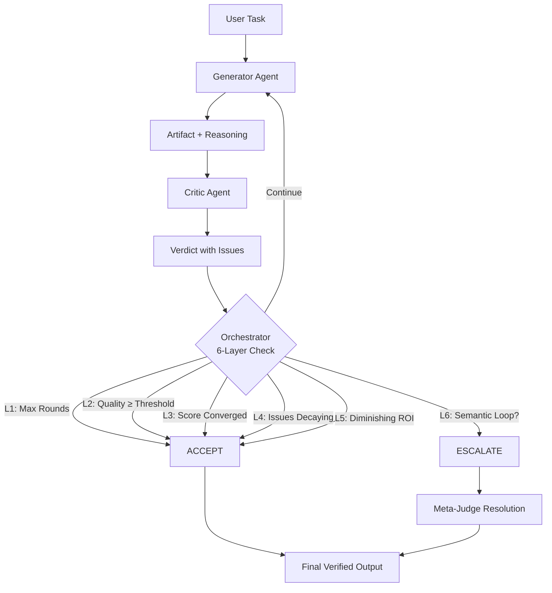

# Dual Agent SDK

<p align="center">
  <strong style="font-size: 1.5em;">🤝 Build self-correcting AI applications with dual-agent collaboration</strong>
</p>

<p align="center">
  <a href="#"></a>
  <a href="#"></a>
  <a href="#"></a>
  <a href="#"></a>
  <a href="#"></a>
</p>

---

## Why Dual Agent SDK?

Single-agent AI systems have fundamental weaknesses that make them unreliable for production workloads:

| Problem | Real-World Impact |
|---|---|
| **Hallucinations** — no second pair of eyes | Incorrect code, fabricated facts, broken logic |
| **No self-correction** — models rarely catch their own mistakes | Bugs and vulnerabilities ship to production |
| **Infinite loops** — agents debate without converging | Wasted tokens, hung pipelines, timeout failures |

**Dual Agent SDK** solves all three with a **Generator-Critic pattern** backed by a **6-layer anti-loop convergence protocol**. One agent creates. Another reviews. A structured orchestrator guarantees the loop terminates -- every time.



## Features

| | |
|---|---|
| 🧠 **Generator-Critic Pattern** | One model creates with structured reasoning; another rigorously reviews with severity-ranked issues |
| 🛡️ **6-Layer Anti-Loop Protocol** | Chain of Responsibility pattern. Each layer checks for convergence independently. Guaranteed termination |
| 🔌 **Multi-Provider Ready** | Anthropic and OpenAI adapters built-in. Bring your own adapter with a 3-method interface |
| 📊 **Structured Output** | Pydantic models (Python) and Zod schemas (TypeScript) validate every agent response |
| 🌐 **Dual Ecosystem** | First-class Python and TypeScript packages with identical APIs and behavior |
| ⚖️ **Escalation Protocol** | Semantic loop detection triggers a meta-judge to resolve deadlocks with a final binding decision |
| 📈 **Observable** | Full round-by-round audit trail: artifacts, verdicts, issues, confidence scores, and convergence decisions |

## Quick Start

### Python

```bash
pip install dual-agent-sdk
```

```python
import asyncio
from dual_agent_sdk import (
    DualAgentOrchestrator,
    AnthropicAdapter,
    OpenAIAdapter,
    AgentConfig,
)

async def main():
    orchestrator = DualAgentOrchestrator(
        generator=AnthropicAdapter(model="claude-sonnet-4-6"),
        critic=OpenAIAdapter(model="gpt-4o"),
    )

    result = await orchestrator.run(
        "Write a secure authentication middleware for FastAPI with JWT verification"
    )

    print(f"✅ Final result (confidence: {result.confidence:.2f})")
    print(f"   Rounds: {len(result.rounds)}")
    print(f"   Decision: {result.decision}")
    print(f"\n{result.content}")

asyncio.run(main())
```

### TypeScript

```bash
npm install dual-agent-sdk
```

```typescript
import {
  DualAgentOrchestrator,
  AnthropicAdapter,
  OpenAIAdapter,
} from 'dual-agent-sdk';

async function main() {
  const orchestrator = new DualAgentOrchestrator(
    new AnthropicAdapter({ model: 'claude-sonnet-4-6' }),
    new OpenAIAdapter({ model: 'gpt-4o' }),
  );

  const result = await orchestrator.run(
    'Write a secure authentication middleware for Express with JWT verification',
  );

  console.log(`✅ Final result (confidence: ${result.confidence.toFixed(2)})`);
  console.log(`   Rounds: ${result.rounds.length}`);
  console.log(`   Decision: ${result.decision}`);
  console.log(`\n${result.content}`);
}

main();
```

## How It Works

Each collaboration round follows a disciplined, fully-observable pipeline:

1. **Generate** -- The Generator agent produces an `Artifact` containing the solution, a confidence score, and explicit reasoning.
2. **Critique** -- The Critic agent reviews the artifact and returns a `Verdict` with issues ranked by severity (`critical`, `major`, `minor`, `style`).
3. **Converge** -- The Orchestrator runs the verdict through six sequential checks (Chain of Responsibility):
   - **L1 -- Hard Ceiling**: Have we exceeded `max_rounds`? If so, accept the best artifact so far.
   - **L2 -- Quality Threshold**: Does the confidence score meet or exceed `quality_threshold`? If so, accept.
   - **L3 -- Score Convergence**: Is the score delta between rounds below `convergence_threshold`? If so, accept -- we are no longer meaningfully improving.
   - **L4 -- Severity Decay**: Are critical and major issues trending to zero? If so, accept.
   - **L5 -- Diminishing ROI**: Is this round's improvement less than `1/roi_decay_factor` of the previous? If so, accept -- further rounds cost more than they are worth.
   - **L6 -- Semantic Loop Detection**: Are the last two artifacts semantically nearly identical (cosine similarity > `loop_similarity_threshold`)? If so, escalate to the meta-judge.
4. **Resolve** -- The Orchestrator either **accepts** the artifact, **continues** with filtered feedback sent back to the Generator, or **escalates** a detected deadlock to the meta-judge for a final binding decision.

## Configuration

Every convergence parameter is tunable:

| Parameter | Type | Default | Description |
|---|---|---|---|
| `max_rounds` | `int` | `5` | Maximum Generator-Critic round trips |
| `quality_threshold` | `float` | `0.85` | Auto-accept when confidence >= this value |
| `convergence_threshold` | `float` | `0.02` | Accept when score delta between rounds < this |
| `roi_decay_factor` | `float` | `2.0` | Each round must improve at least `1/factor` of the prior |
| `loop_similarity_threshold` | `float` | `0.92` | Cosine similarity above this triggers escalation |
| `enable_escalation` | `bool` | `true` | Enable meta-judge resolution on detected deadlocks |

```python
# Python: custom convergence tuning
orchestrator = DualAgentOrchestrator(
    generator=gen,
    critic=crit,
    config=AgentConfig(
        max_rounds=8,
        quality_threshold=0.90,
        convergence_threshold=0.01,
    ),
)
```

```typescript
// TypeScript: custom convergence tuning
const orchestrator = new DualAgentOrchestrator(gen, crit, {
  maxRounds: 8,
  qualityThreshold: 0.9,
  convergenceThreshold: 0.01,
});
```

## Bringing Your Own Adapter

The adapter interface is intentionally minimal. Implement three methods and you can orchestrate any LLM:

```python
# Python
class MyAdapter(BaseAdapter):
    async def generate(self, prompt: str, system_prompt: str) -> str: ...
    def get_model_name(self) -> str: ...
    def get_provider_name(self) -> str: ...
```

```typescript
// TypeScript
class MyAdapter extends BaseAdapter {
  async generate(prompt: string, systemPrompt: string): Promise<string> { ... }
  getModelName(): string { ... }
  getProviderName(): string { ... }
}
```

See the [Custom Adapters guide](docs/adapters.md) for full examples with error handling, retries, and structured output support.

## Project Structure

```
dual-agent-sdk/
├── python/                    # Python package
│   ├── src/dual_agent_sdk/
│   │   ├── __init__.py        # Public API exports
│   │   ├── orchestrator.py    # DualAgentOrchestrator
│   │   ├── convergence.py     # 6-layer ConvergenceEngine
│   │   ├── loop_detector.py   # SemanticLoopDetector
│   │   ├── models.py          # Pydantic models
│   │   ├── adapters/          # Anthropic, OpenAI, Base
│   │   └── prompts/           # System prompt templates
│   ├── tests/
│   └── pyproject.toml
├── typescript/                # TypeScript package
│   ├── src/
│   │   ├── index.ts           # Public API exports
│   │   ├── orchestrator.ts    # DualAgentOrchestrator
│   │   ├── convergence.ts     # 6-layer ConvergenceEngine
│   │   ├── loop-detector.ts   # SemanticLoopDetector
│   │   ├── models.ts          # Zod schemas + types
│   │   ├── adapters/          # Anthropic, OpenAI, Base
│   │   └── prompts/           # System prompt templates
│   ├── tests/
│   └── package.json
├── docs/
├── CHANGELOG.md
├── CODE_OF_CONDUCT.md
├── CONTRIBUTING.md
└── LICENSE
```

## Documentation

| Document | Description |
|---|---|
| [Getting Started](docs/getting-started.md) | Installation, first run, basic configuration |
| [Architecture](docs/architecture.md) | Deep dive into the Generator-Critic pattern and component design |
| [API Reference](docs/api-reference.md) | Full API docs for orchestrator, convergence engine, adapters, and models |
| [Convergence Protocol](docs/convergence-protocol.md) | Detailed explanation of the 6-layer anti-loop protocol |
| [Custom Adapters](docs/adapters.md) | How to build and register custom LLM adapters |

## Contributing

We welcome contributions! Dual Agent SDK is built for the community.

- **🐛 Found a bug?** Open an issue using the [bug report template](.github/ISSUE_TEMPLATE/bug_report.md).
- **💡 Have an idea?** Open a [feature request](.github/ISSUE_TEMPLATE/feature_request.md).
- **🔧 Want to code?** Read [CONTRIBUTING.md](CONTRIBUTING.md) and pick a good first issue.

All contributors are expected to follow our [Code of Conduct](CODE_OF_CONDUCT.md).

## License

MIT © 2026 Dual Agent SDK Contributors -- see [LICENSE](LICENSE) for full text.
