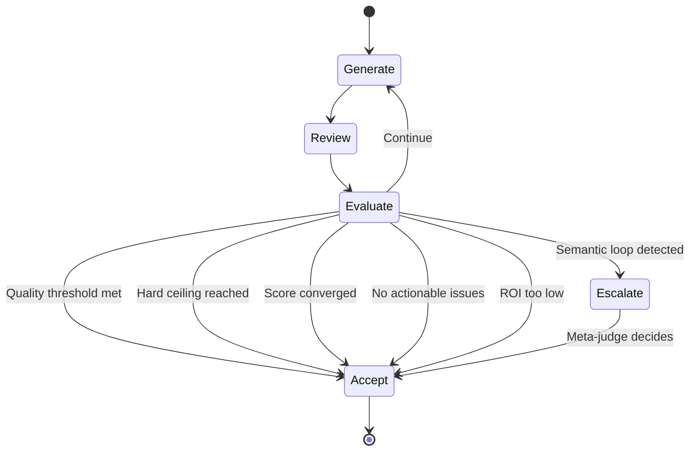

# Architecture

This document describes the internal architecture of Dual Agent SDK -- the state machine, convergence protocol, adapter layer, and design decisions.

---

## Overview: The Generator-Critic Pattern

Dual Agent SDK implements a **structured collaboration** between two LLM agents:

- **Generator**: Produces solutions (artifacts) to a given task. It receives feedback from the Critic and iteratively improves its output.

- **Critic**: Reviews the Generator's output, assigns a quality score, and reports specific issues with severity levels and fix hints.

- **Orchestrator**: The state machine that ties them together. It manages the loop, evaluates convergence, filters feedback, tracks disputes, and escalates deadlocks.

The key insight is that **LLMs are better at finding flaws than at avoiding them**. A separate Critic -- potentially from a different model family -- can catch issues the Generator missed. Multiple rounds of review and revision produce higher-quality output than a single pass.

---

## State Machine

The orchestrator implements the following state machine:



### States

| State | Description |
|---|---|
| **Generate** | The Generator produces an `Artifact` (content, reasoning, confidence, uncertain parts). On round 2+, it also receives filtered critic feedback. |
| **Review** | The Critic reviews the artifact and produces a `Verdict` (score, issues, blocking flag, suggestion, agreement level). |
| **Evaluate** | The `ConvergenceEngine` runs the six-layer chain-of-responsibility. It returns `"accept"`, `"continue"`, or `"escalate"`. |
| **Escalate** | The meta-judge (the Critic in tie-breaker mode) reviews all rounds and selects or synthesizes the best result. |
| **Accept** | The loop terminates and the best artifact is returned to the caller. |

---

## The 6-Layer Convergence Protocol

The convergence protocol is a **chain of responsibility**: six checks evaluated in priority order. The first check that fires determines the outcome.

### Layer 1: Hard Ceiling

```python
if round_num >= config.max_rounds:
    return "accept"
```

**Purpose**: Guarantees termination. No matter what, the loop stops after `max_rounds`. This is a safety valve, not a heuristic -- if your quality bar is high, raise `max_rounds` rather than relying on this layer.

### Layer 2: Quality Threshold

```python
if verdict.score >= config.quality_threshold and not verdict.is_blocking:
    return "accept"
```

**Purpose**: Short-circuit when the output is already good enough. If the critic rates the artifact highly AND finds nothing fundamentally wrong (no blocking issues), there is no point iterating further.

### Layer 3: Score Convergence

```python
if abs(verdict.score - prev_verdict.score) < config.convergence_threshold:
    return "accept"
```

**Purpose**: Detect diminishing returns. If the score barely changed from the previous round, further iterations are unlikely to yield meaningful improvement. The threshold defaults to 0.02.

### Layer 4: Issue Decay

| Round | Actionable Issues |
|---|---|
| 1 | `critical` + `major` |
| 2 | `critical` only |
| 3+ | none |

**Purpose**: Progressive filtering of feedback. In early rounds, the critic can flag both critical and major issues. By round 2, only critical issues are fed back. By round 3, the generator is trusted to work independently -- if it still cannot produce acceptable output, the loop terminates. This prevents the critic from nitpicking indefinitely.

### Layer 5: ROI Check

```python
improvement = verdict.score - prev_verdict.score
min_improvement = 0.05 * (roi_decay_factor ** (round_num - 1))
if improvement < min_improvement:
    return "accept"
```

**Purpose**: Model diminishing returns explicitly. The minimum required improvement grows exponentially across rounds. With `roi_decay_factor=2.0`:
- Round 2 requires improvement >= 0.10
- Round 3 requires improvement >= 0.20
- Round 4 requires improvement >= 0.40

Large improvements are expected early; marginal gains are rejected late.

### Layer 6: Semantic Loop Detection

```python
if loop_detector.is_looping(current_content):
    return "escalate" if config.enable_escalation else "accept"
```

**Purpose**: Detect when the Generator is producing semantically identical output across rounds -- a sign that the critic's feedback is not being meaningfully incorporated, or that the agents are disagreeing without resolution. When escalation is enabled, this triggers the meta-judge instead of an unconditional accept.

The detector uses **Jaccard word-set similarity** with a sliding window (default window size: 3). If any pairwise similarity exceeds `loop_similarity_threshold` (default 0.92), a loop is declared.

---

## Escalation Protocol

When a semantic loop is detected and `enable_escalation` is `True`, the orchestrator invokes a **meta-judge**:

1. All rounds are summarized (artifact snippet, verdict score, issues, blocking status).
2. The Critic is given a special meta-judge prompt: "You are a META-JUDGE. Review all rounds and select the SINGLE BEST artifact."
3. The Critic returns the selected content, which is wrapped in a new `Artifact` and returned.

If the meta-judge call fails (API error, malformed response), the orchestrator falls back to returning the highest-scoring artifact from the round history.

---

## Adapter Architecture

```
┌──────────────────────────────────────────┐
│           DualAgentOrchestrator           │
│                                           │
│  generator: BaseAdapter   ◄── interface   │
│  critic: BaseAdapter       ◄── interface   │
└──────────────────────────────────────────┘
                    │
                    │ implements
          ┌─────────┴─────────┐
          │                   │
  ┌───────▼───────┐  ┌───────▼───────┐
  │ Anthropic     │  │ OpenAI        │
  │ Adapter       │  │ Adapter       │
  │               │  │               │
  │ Claude models │  │ GPT models    │
  └───────────────┘  └───────────────┘
```

The orchestrator never calls LLM APIs directly. It interacts with the `BaseAdapter` interface, which defines two methods:

- `generate(system_prompt, user_prompt, **kwargs) -> str` -- free-form text generation.
- `generate_structured(system_prompt, user_prompt, output_schema, **kwargs) -> dict` -- schema-constrained generation.

This makes the SDK provider-agnostic. To add a new provider (e.g., Groq, Together, a local model via Ollama), you only need to implement these two methods and a `model_name` property.

---

## Data Flow

```
Task + Context
      │
      ▼
┌─────────────────┐
│ Generator Prompt │────► Generator Adapter ────► Artifact
│   Builder        │         (LLM call)           (typed)
└─────────────────┘
                                                    │
                                                    ▼
┌─────────────────┐    ┌──────────────────┐
│ Critic Prompt   │◄───│ Artifact + Task  │
│   Builder       │    └──────────────────┘
└─────────────────┘
      │
      ▼
Critic Adapter ────► Verdict (typed)
 (LLM call)              │
                         ▼
                 ┌──────────────────┐
                 │ ConvergenceEngine│
                 │  (6-layer chain) │
                 └──────┬───────────┘
                        │
            ┌───────────┼───────────┐
            ▼           ▼           ▼
         accept     continue    escalate
            │           │           │
            ▼           ▼           ▼
      Return best   Filter     Meta-judge
       artifact     issues       picks
                      │
                      └──► back to Generator
```

---

## Dispute Tracking

The orchestrator tracks **persistent disagreements** between the Generator and Critic. A dispute is created when:

1. The `agreement_level` is below 0.5, OR
2. The verdict has `is_blocking=True`.

Disputes are identified by topic (using the verdict's `suggestion` field) and tracked across rounds. If the same topic recurs, `rounds_unresolved` is incremented. A simple word-overlap heuristic (Jaccard on the first 100 characters of the topic) determines whether a new criticism is the "same" dispute.

Disputes are available via `orchestrator.disputes` (Python) or `orchestrator.activeDisputes` (TypeScript) and can be inspected after the run completes.

---

## Design Decisions and Trade-offs

### Why two agents instead of one with self-review?

A single agent asked to "review your own work" often rubber-stamps its output. Using two separate agents -- ideally from different model families -- introduces genuine diversity of perspective. The Critic has no stake in defending the Generator's choices.

### Why Jaccard similarity instead of embeddings for loop detection?

Jaccard word-set similarity is fast, deterministic, and requires no API calls. It catches most semantic loops in practice because looping generators tend to reuse the same vocabulary and phrasings. The `check_with_embedding` method is available for higher-accuracy detection when an embedding model is available.

### Why issue decay (Layer 4) instead of always feeding back all issues?

Unfiltered feedback often leads to **overcorrection** -- the Generator makes unnecessary changes in response to minor/stylistic criticism and accidentally breaks previously correct parts. By progressively narrowing the set of actionable issues, the protocol focuses the Generator's effort where it matters most.

### Why escalate instead of always accepting on loop detection?

Without escalation, a semantic loop results in an unconditional accept -- you get whatever the Generator happened to produce last. With escalation, the Critic is asked to pick the best version across all rounds. This is almost always better because one of the earlier rounds may have been higher quality before the loop degraded output.

### Why a fixed 6-layer chain instead of a configurable pipeline?

The six layers cover the termination conditions that matter in practice. Making the chain configurable would add complexity without clear benefit, since the order matters (you want safety valves like the hard ceiling before heuristics like ROI) and the existing layers can be tuned via `AgentConfig`.
