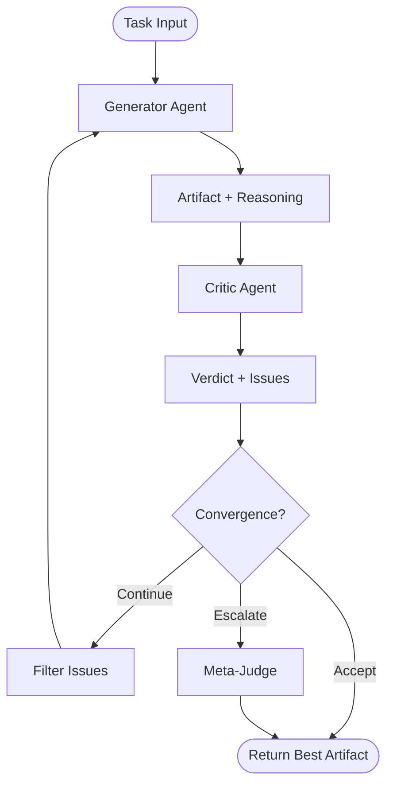

# Dual Agent SDK

**Build self-correcting AI agents with Generator-Critic collaboration.**

Dual Agent SDK is an open-source framework for orchestrating two LLMs in a structured collaboration loop: a **Generator** that produces solutions and a **Critic** that reviews them. A six-layer convergence protocol prevents infinite loops, and semantic loop detection triggers meta-judge escalation when the agents deadlock.

---

## Architecture at a Glance



The orchestrator runs a state machine: **Generate -> Critique -> Evaluate -> (Continue | Accept | Escalate)**. On each iteration the critic's feedback is filtered by severity and fed back to the generator. The loop continues until one of the six convergence layers fires or the hard round ceiling is hit.

---

## Feature Highlights

| Feature | Description |
|---|---|
| **Generator-Critic Pattern** | Two LLMs collaborate in structured roles -- one produces, one reviews. |
| **6-Layer Anti-Loop Protocol** | Hard ceiling, quality threshold, score convergence, issue decay, ROI check, and semantic loop detection prevent runaway iterations. |
| **Structured Output** | Both agents produce typed, schema-validated JSON (Pydantic in Python, Zod in TypeScript). |
| **Multi-Provider** | Built-in adapters for Anthropic (Claude) and OpenAI (GPT). Different models per role. |
| **Semantic Loop Detection** | Jaccard similarity on token sets catches repeating output; optional embedding-based checks for higher accuracy. |
| **Meta-Judge Escalation** | When a deadlock is detected, the critic is promoted to tie-breaker to pick the best artifact. |
| **Dispute Tracking** | Persistent disagreements between Generator and Critic are tracked across rounds. |
| **Graceful Fallbacks** | If structured generation fails, the SDK falls back to free-form text and best-effort JSON parsing. |
| **Provider-Agnostic** | The ``BaseAdapter`` interface makes it trivial to add new LLM backends or mock adapters for testing. |
| **Dual Language** | First-class Python and TypeScript packages with near-identical APIs. |

---

## Quick Links

- **[Getting Started](./getting-started.md)** -- Install, configure, and run your first dual-agent task in 5 minutes.
- **[Architecture](./architecture.md)** -- Deep dive into the state machine, convergence layers, and design decisions.
- **[API Reference](./api-reference.md)** -- Complete reference for every class, method, and parameter.
- **[Convergence Protocol](./convergence-protocol.md)** -- How the 6-layer anti-loop mechanism works and how to tune it.
- **[Adapters](./adapters.md)** -- Built-in adapters, custom adapters, and multi-provider patterns.
- **[Code Review Tutorial](./examples/code-review.md)** -- Walkthrough of a complete code review scenario.

---

## Installation

**Python** (requires Python 3.10+):
```bash
pip install dual-agent-sdk
```

**TypeScript** (requires Node 18+):
```bash
npm install dual-agent-sdk
```

---

## 30-Second Quickstart

```python
import asyncio
from dual_agent_sdk import (
    DualAgentOrchestrator, AnthropicAdapter, OpenAIAdapter,
)

async def main():
    gen = AnthropicAdapter(model="claude-sonnet-4-6")
    crit = OpenAIAdapter(model="gpt-4o")
    orch = DualAgentOrchestrator(gen, crit)
    result = await orch.run("Write a function to validate email addresses.")
    print(result.content)

asyncio.run(main())
```

```typescript
import { DualAgentOrchestrator, AnthropicAdapter, OpenAIAdapter } from 'dual-agent-sdk';

const gen = new AnthropicAdapter('claude-sonnet-4-6');
const crit = new OpenAIAdapter('gpt-4o');
const orch = new DualAgentOrchestrator(gen, crit);
const result = await orch.run('Write a function to validate email addresses.');
console.log(result.content);
```

Set ``ANTHROPIC_API_KEY`` and ``OPENAI_API_KEY`` environment variables and you are ready to go.

---

## Project Status

Dual Agent SDK is in active development (v0.1.0). The core orchestration loop, convergence protocol, adapters, and models are complete and ready for experimentation. Contributions and feedback are welcome.

**License:** MIT
